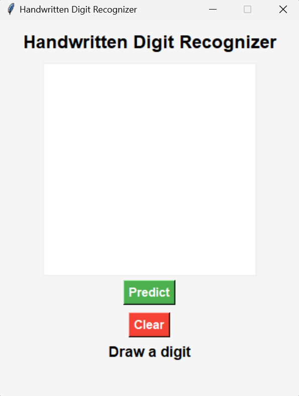
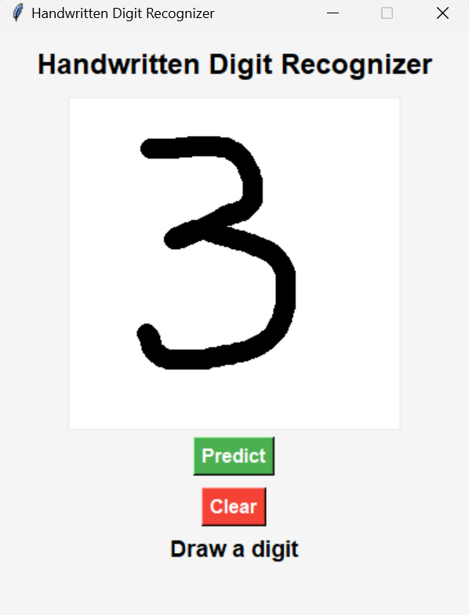
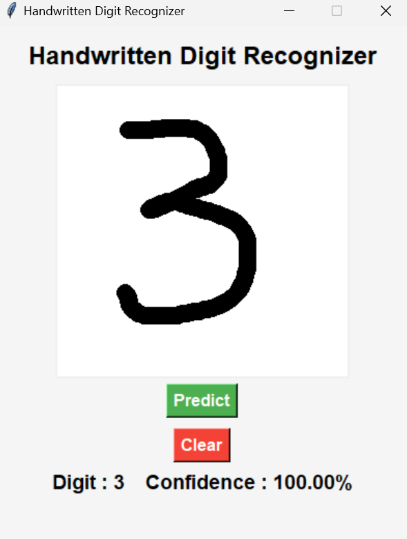

# 📝 Handwritten Digit Recognizer

A desktop application that recognizes handwritten digits (0–9) using a Convolutional Neural Network (CNN) trained on the MNIST dataset. Users can draw a digit on the screen, and the application predicts the digit along with its confidence score.

---

## 📌 Features

- Draw handwritten digits using the mouse.
- Predict digits from **0 to 9**.
- Display prediction confidence.
- CNN model trained using the MNIST dataset.
- Simple and user-friendly desktop interface built with Tkinter.

---

## 🛠️ Technologies Used

- Python
- TensorFlow
- Keras
- NumPy
- Pillow (PIL)
- Tkinter

---

## 📂 Project Structure

```
Handwritten-Digit-Recognizer/
│
├── app.py
├── gui.py
├── model.py
├── predict.py
├── train_model.py
├── mnist_model.keras
├── requirements.txt
├── README.md
└── Results/
    ├── home.png
    ├── drawing.png
    └── prediction.png
```

---

## 📊 Model

- Model: Convolutional Neural Network (CNN)
- Dataset: MNIST Handwritten Digits
- Input Size: 28 × 28 grayscale images
- Output: Predicted digit (0–9)
- Optimizer: Adam
- Loss Function: Categorical Crossentropy

---

## 🚀 Installation

### 1. Clone the repository

```bash
git clone https://github.com/Likitha-Thumma/Handwritten-Digit-Recognizer.git
```

### 2. Navigate to the project

```bash
cd Handwritten-Digit-Recognizer
```

### 3. Create a virtual environment

```bash
python -m venv venv
```

### 4. Activate the virtual environment

Windows

```bash
.\venv\Scripts\activate
```

### 5. Install dependencies

```bash
pip install -r requirements.txt
```

---

## ▶️ Train the Model

Run:

```bash
python train_model.py
```

This creates:

```
mnist_model.keras
```

---

## ▶️ Run the Application

```bash
python app.py
```

Draw a digit using your mouse and click **Predict**.

---

## 📸 Output

### Home Screen



---

### Draw a Digit



---

### Prediction



---

## 🎯 Future Improvements

- Recognize multiple handwritten digits.
- Improve GUI design.
- Add support for webcam image recognition.
- Train on custom handwritten datasets.
- Export prediction history.

---

## 📈 Learning Outcomes

This project helped me learn:

- Image preprocessing
- Convolutional Neural Networks (CNN)
- TensorFlow & Keras
- Model training and evaluation
- Desktop GUI development with Tkinter

---

## 👩‍💻 Author

**Likitha Thumma**

Handwritten Digit Recognizer using CNN and TensorFlow

---
